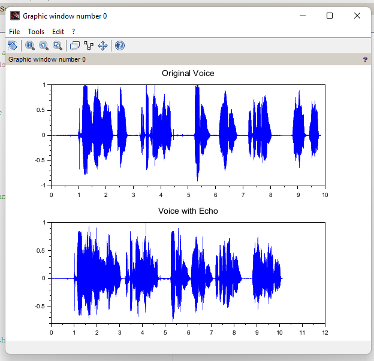

# Digital Echo Generation in Audio Signals using Scilab

This repository contains a Scilab-based implementation of digital echo generation in audio signals as part of a Digital Signal Processing (DSP) mini project.

## 📌 Project Overview

This project demonstrates how to simulate the echo effect in audio by applying DSP techniques. Using Scilab, the original audio signal is delayed and attenuated to produce a realistic echo, commonly used in music, movies, and communication systems.

## 🎯 Objective

To simulate an echo effect by digitally delaying and attenuating an audio signal using Scilab's signal processing capabilities.

## 🛠️ Tools Used

* **Software:** Scilab (with Signal Processing Toolbox)
* **Input:** Mono or stereo `.wav` audio files

## 🖐️ Theory

An echo is digitally generated by:

```
y[n] = x[n] + α * x[n - D]
```

Where:

* `x[n]` is the input signal
* `α` is the attenuation factor (0 < α < 1)
* `D` is the delay in samples
* `y[n]` is the output (echo-added) signal

## 📄 Contents

* `#code for digitalecho.sci` – Scilab code to generate echo
* `original.wav` – Original audio file
* `voice_with_echo.wav` – Output audio with echo
* `Waveform.png` – Visualization of original vs echoed waveform
* `README.md` – This file

## 📊 Output

* Audio files are played back to demonstrate the echo effect.
* Time-domain plots visualize the delayed signal overlaid on the original.



## 🚀 Applications

* Music production and sound design
* Virtual reality acoustic simulations
* Speech enhancement systems

## ✅ Conclusion

The project effectively demonstrates how simple mathematical operations and Scilab code can create real-time audio effects like echo using DSP concepts.
